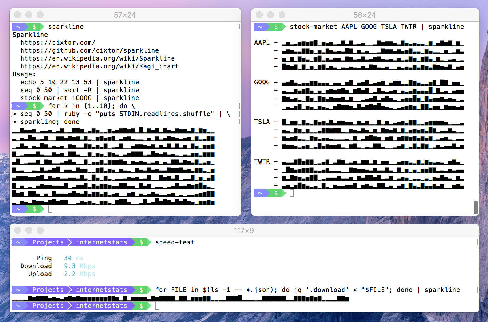

### Sparkline

```shell
$ stock-market +GOOG | sparkline  ⇶  ▂▂▃▆█▃▆▅▁▅▃▂▅▄▇▄▇▆▁▄
```

A [Sparkline](https://en.wikipedia.org/wiki/Sparkline) is a very small line chart, typically drawn without axes or coordinates. It presents the general shape of the variation (typically over time) in some measurement, such as temperature or stock market price, in a simple and highly condensed way. Sparklines are small enough to be embedded in text, or several sparklines may be grouped together as elements of a small multiple. Whereas the typical chart is designed to show as much data as possible, and is set off from the flow of text, sparklines are intended to be succinct, memorable, and located where they are discussed.

Sparklines are frequently used in line with text. For example: The Dow Jones Industrial Average for February 7, 2006 sparkline which illustrates the fluctuations in the Down Jones index on February 7, 2006. The sparkline should be about the same height as the text around it. Tufte offers some useful design principles for the sizing of sparklines to maximize their readability.

Check this list of [Things You Can Do with Sparklines](https://github.com/holman/spark/wiki/Wicked-Cool-Usage).



Original idea by [holman/spark](https://github.com/holman/spark).
